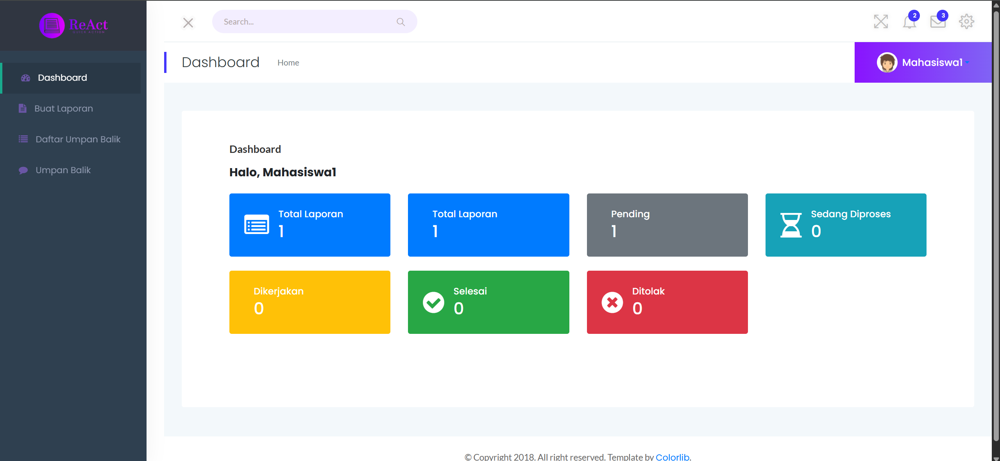

link : https://reportaction.dbsnetwork.my.id/ 

# 🏢 ReAct - Manajemen Fasilitas Kampus

**ReAct** (Report and Action) adalah sistem manajemen fasilitas Jurusan Teknologi Informasi berbasis web yang dirancang untuk memudahkan pengelolaan sarana dan prasarana, pelaporan kerusakan, penugasan teknisi, serta pelacakan status dan prioritas perbaikan.

---

## 🚀 Fitur Utama

* ✅ Autentikasi dan manajemen pengguna berdasarkan peran (admin, sarana-prasarana, teknisi, mahasiswa/dosen/tendik)
* 🧾 Pelaporan kerusakan fasilitas secara real-time
* 📌 Penentuan prioritas perbaikan berdasarkan bobot/kriteria tertentu
* 🛠️ Penugasan teknisi sesuai keahlian
* 📷 Upload foto bukti kerusakan
* 📊 Statistik dan riwayat perbaikan
* 📁 Ekspor data (PDF)
* 🔍 Filter dan pencarian cerdas (AJAX + DataTables)

---

## 🛠️ Teknologi yang Digunakan

* **Backend**: Laravel 10
* **Frontend**: Blade, SRTDash, jQuery, AJAX
* **Database**: MySQL
* **Library Tambahan**:

  * SweetAlert2
  * Select2
  * DataTables
  * DomPDF

---

## 📂 Struktur Modul

```
├── Auth (login, register, logout)
├── Dashboard (statistik umum)
├── Master Data
│   ├── Gedung, Lantai, Ruang
│   ├── Kategori barang & Sarana
│   └── User & Level Akses
├── Pelaporan Kerusakan
│   ├── Mahasiswa/Dosen/Tendik
│   └── Proses Validasi oleh Sarpras
├── Manajemen Perbaikan
│   ├── Prioritas oleh Sarpras
│   └── Eksekusi oleh Teknisi
├── Riwayat dan Statistik
├── Export/Import (Excel/PDF)
└── Umpan Balik
```

## 📸 Cuplikan Layar

> *(Tambahkan screenshot dari dashboard, form laporan, dan halaman prioritas di sini jika tersedia)*



---

## 🤝 Kontribusi

Pull request dan masukan sangat disambut! Silakan fork repository ini dan buat branch baru untuk fitur atau perbaikan Anda.

---

## 📄 Lisensi

MIT License © 2025 - Tim Pengembang ReAct

---

